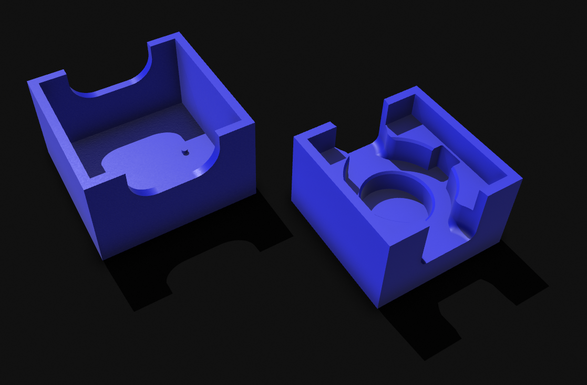
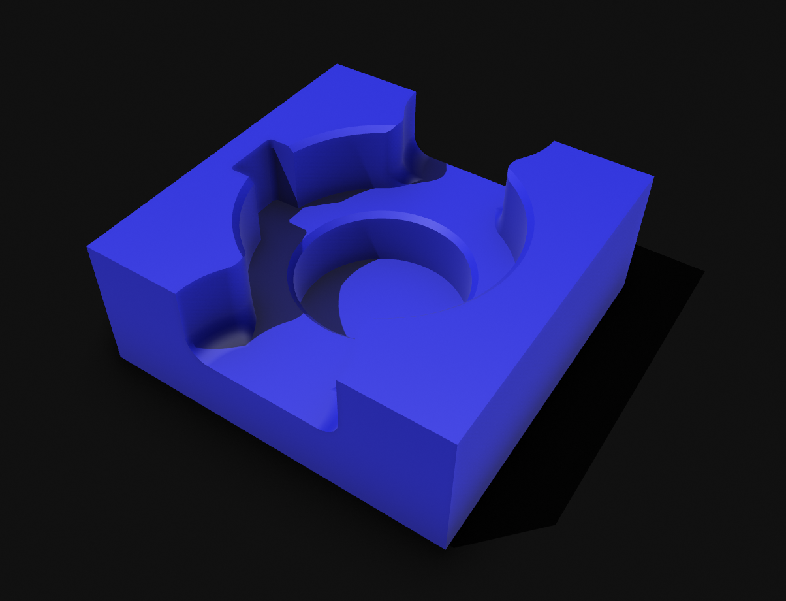

## PPMS Puck Transport Box
This folder contains the design for a QuantumDesign PPMS puck transport box. The standard AC transport / resistivity puck fits perfectly in the box, and the lid provides protection against dust. The lid contains two small pins that will push on the screws of the puck to make sure that the sample or wirebonds will survive transportation in the box. In addition, there is also a design for a PPMS puck wirebond holder, which is a modification of the box's bottom part. 
#### PPMS Transport box

#### PPMS Wirebond adapter

